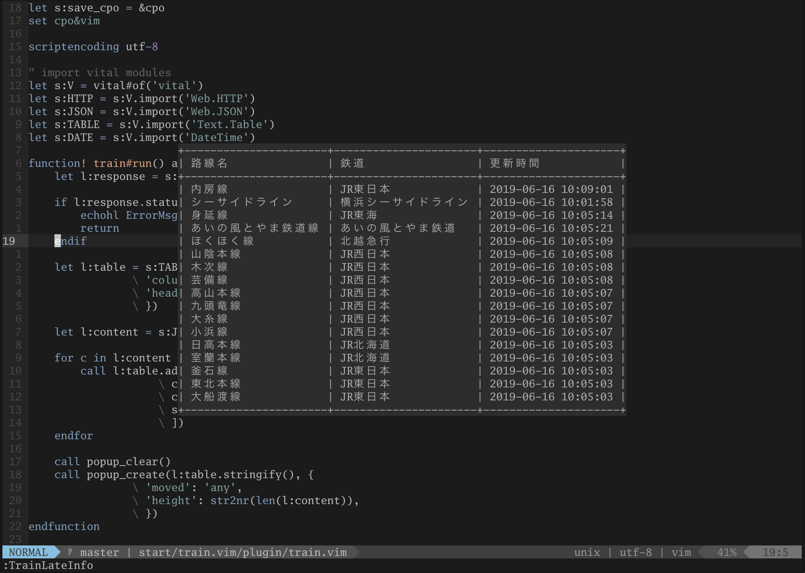
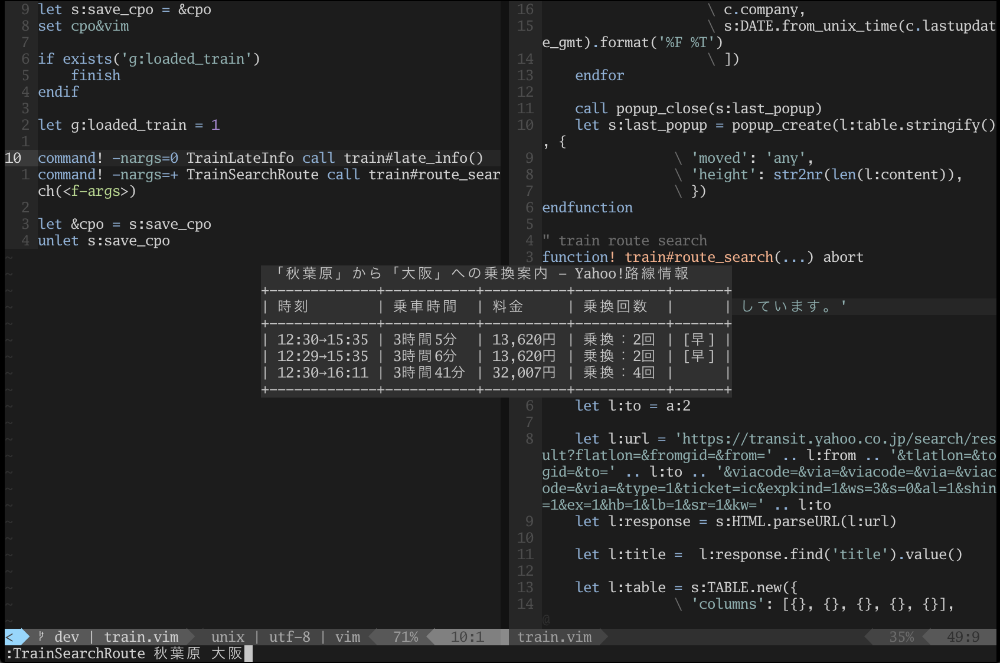

# train.vim
電車情報プラグインです。  
Vimのバージョンが8.1.1561以上の場合はポップアップウィンドウに結果が表示されます。





# 機能
- 遅延情報
- 乗り換えルート検索

# 必須
- curl

# インストール
## dein.vim
```toml
[[plugins]]
repo = 'skanehira/train.vim'
```

## プラグインマネージャなしの場合
```sh
$ mkdir -p $HOME/.vim/pack/plugins/start/
$ cd $HOME/.vim/pack/plugins/start/
$ git clone https://github.com/skanehira/train.vim
```

# 使い方
```vim
" 遅延情報表示
:TrainLateInfo

" ルート検索
:TrainSearchRoute 秋葉原 東京
```
